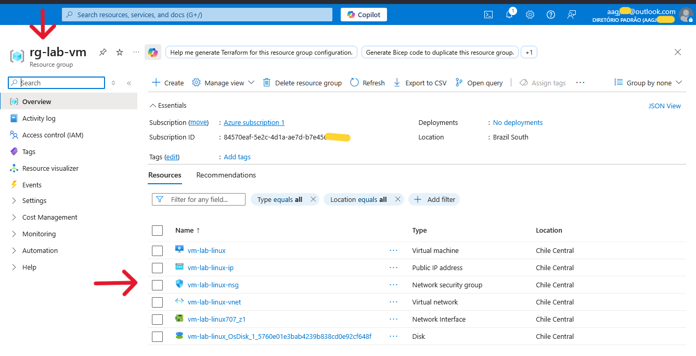
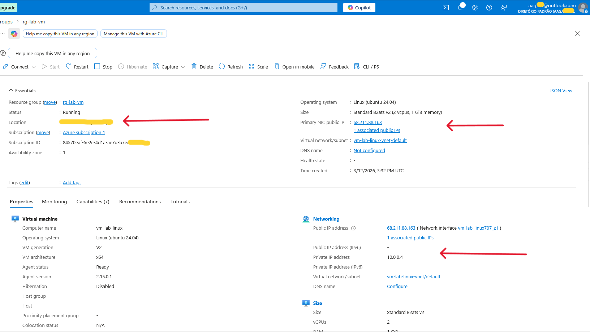
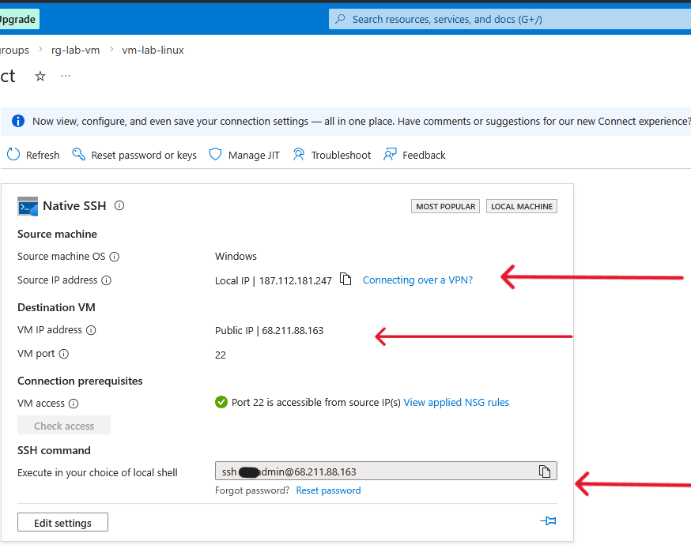
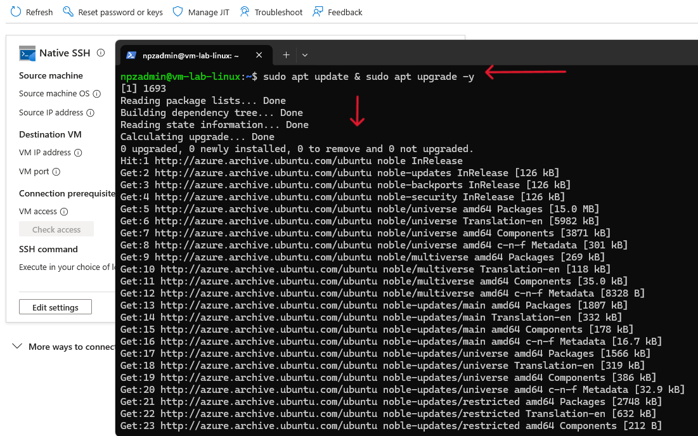
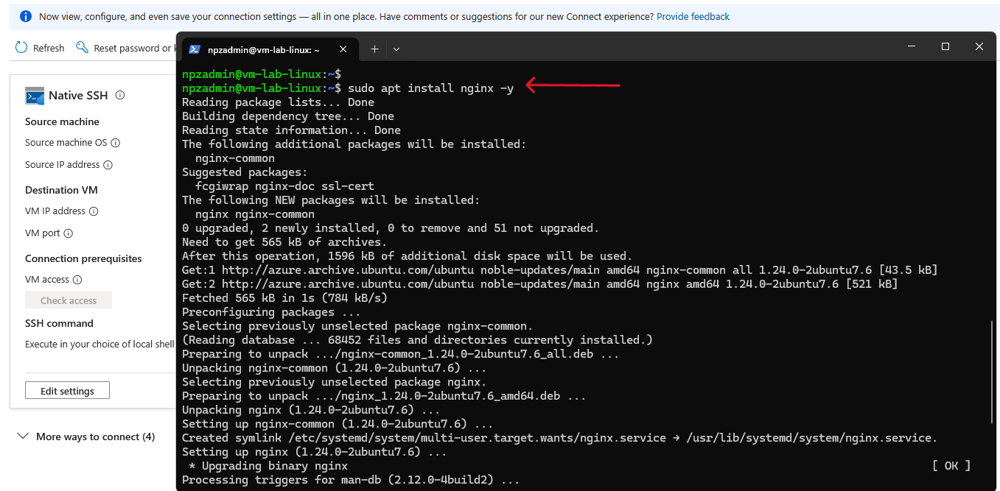
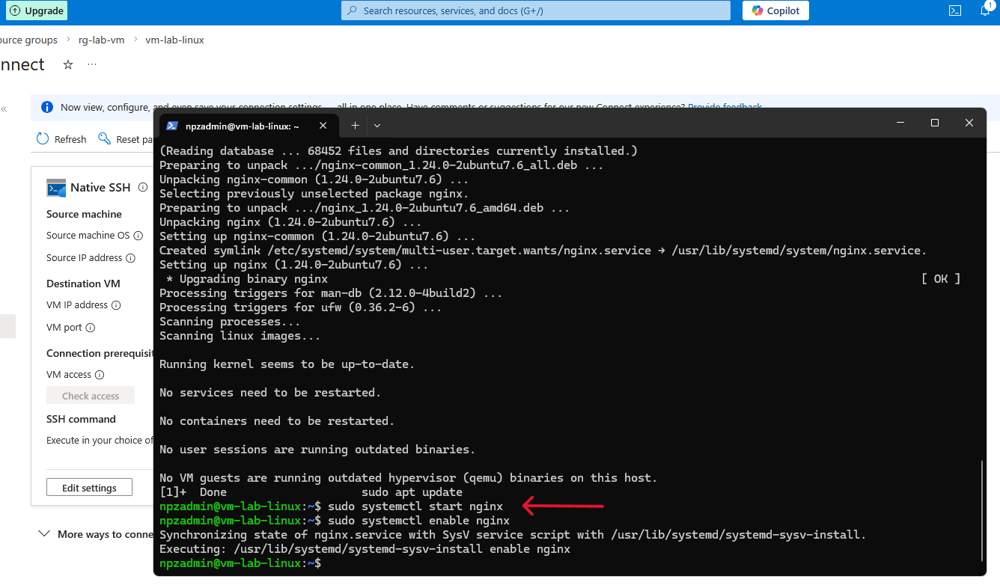
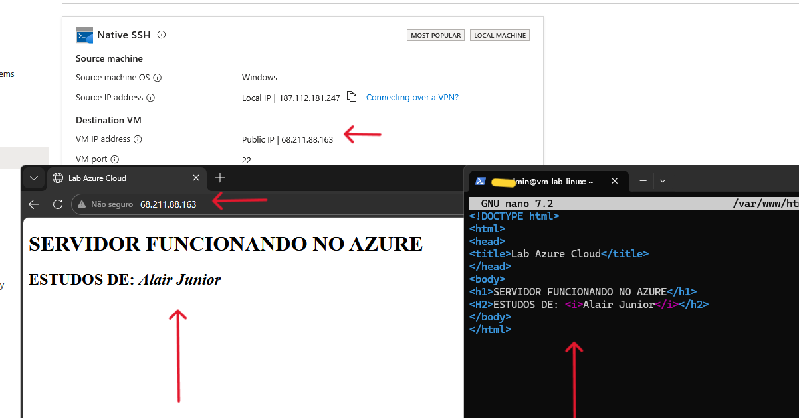

# 🧪 Azure Linux VM + Nginx Web Server

Projeto prático de implementação de servidor web utilizando Linux (Ubuntu Server) e Nginx em ambiente cloud.


## 📌 Objetivo

Desenvolver experiência prática em:

* Provisionamento de infraestrutura na nuvem
* Administração de sistemas Linux
* Publicação de aplicação web
* Configuração básica de rede

## ☁️ Infraestrutura

* Máquina Virtual Linux (Ubuntu Server)
* IP público configurado
* Acesso remoto via SSH
* Liberação de porta HTTP (80)



---

## 🚀 Etapas do projeto

### 1. Criação da VM

* Provisionamento da máquina virtual Linux no Azure
* Definição de usuário administrador
* Configuração de acesso via SSH



---

### 2. Acesso ao servidor



---

### 3. Atualização do sistema



---

### 4. Instalação do Nginx



---

### 5. Verificação do serviço



---

### 6. Teste de acesso e Customização da página

```bash
sudo nano /var/www/html/index.nginx-debian.html
```

Acessar via navegador:



---

## 🧠 Aprendizados

* Deploy de servidor web em ambiente cloud
* Gerenciamento de serviços no Linux
* Configuração de acesso remoto via SSH
* Noções de rede e liberação de portas

